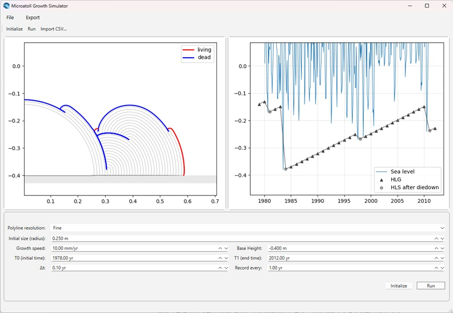
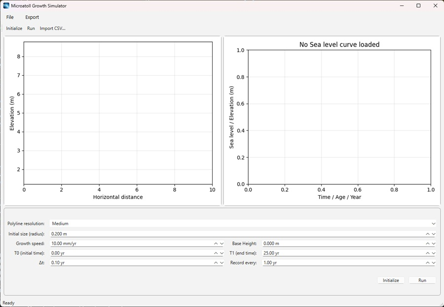
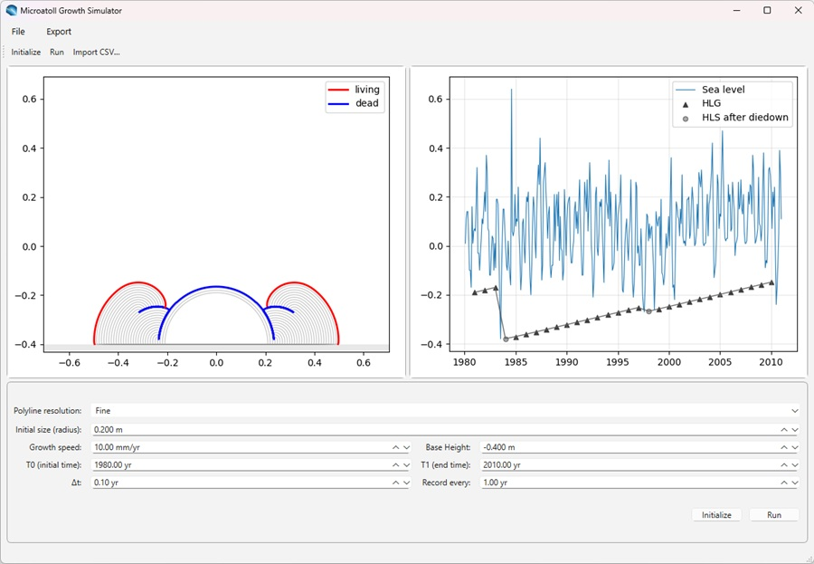

# 🌊 Microatoll Simulator (GUI Version)

Microatoll Growth Simulator provides an interactive GUI application for coral microatoll growth and sea-level reconstruction.



---

## 🧭 Installation and Launch Guide

### 🖥️ Visual Studio Code (Recommended)

#### ■STEP 1. Build a Python environment

> **If you don’t have a Python environment yet (install from scratch):**  
> Follow the steps below to set up Visual Studio Code and Python together.

> **If you are already an experienced Python user:**
> Simply clone this repository (https://github.com/JKomori49/microatoll_GUI.git) in your environment and jump to [STEP 3](#step-3-install-the-simulator-package).

1. **Install [Visual Studio Code](https://code.visualstudio.com/)**

2. **Install [Python ≥3.10](https://www.python.org/downloads/)**  
   During installation, make sure to check the box: **“Add Python to PATH”**

3. **Launch VS Code and Install Git**  
   - When prompted, install the **Python Extension**
		- Press **`Ctrl + Shift + x`** to open Extensions
		- Enter *python* in the search bar and install Python and Pylance (provided by Microsoft)
   - Make sure that Git is installed
		- Open Terminal in VS code ( [View -> Terminal] or Press **```Ctrl + Shift + `(backtick)```**)
		- Type the following command and enter
			```bash
			git --version
			```
		
		- If git is not found (e.g., <font color="#CD5C5C">git : The term 'git' is not recognized as the name of a cmdlet, function, script file, or operable program</font>...), run the following commands:
		
			Windows:
			```bash
			winget install --id Git.Git -e
			```
		
			macOS:
			```bash
			xcode-select --install
			```
		
			Ubuntu:
			```bash
			sudo apt install git
			```
		
		- Relaunch VS code once installation is completed
	- If you cannot install git via command line, visit the [Git website](https://git-scm.com/install/) and download installer.
#### ■STEP 2. Clone the Repository from GitHub
1. **Launch Visual Studio Code**
2. **Open the Command Palette**  
	- Press **`Ctrl + Shift + P`** (Windows/Linux)
3. **Search for “Clone Repository”**  
	- Type `Clone Repository` and select **“Git: Clone”** -> **“🐱Clone from GitHub”**
4. **Enter the repository URL**
	```
	https://github.com/JKomori49/microatoll_GUI.git
	```
5. **Choose a local folder**  
	- Select where you want to save the project (e.g., `Documents\GitHub\`)
6. **Open the cloned folder**  
	- When prompted “Open cloned repository?”, click **Open**

#### ■STEP 3. Install the Simulator Package
1. Open the integrated terminal:
	-  [View -> Terminal] or Press **```Ctrl + Shift + `(backtick)```**
2. Run the following command to install the package:
	```bash
	pip install -e .
	```

3. Once Installation is complete, start Microatoll Simulator by typing:
	```bash
	microatoll-sim
	```

---
## 🥏 Microatoll Growth Simulator - User Manual
### ■ The Main Window


### ■ 1. Load Sea-Level Data

The **Microatoll Growth Simulator** can simulate coral microatoll growth using sea-level curve recorded in a CSV file.

1. Prepare a CSV file containing time (year) vs. altitude as follows (sample data file is provided in `sample/`):

	```csv
	year,height
	1980.07947,0.01
	1980.16162,0.11
	1980.2439,0.14
	1980.32605,0.14
	1980.4082,0.03
	1980.49036,-0.1
	1980.57263,-0.1
	...
	```
2. Click **Import CSV…** and select your data file from the folder and **Open**.

	The sea-level curve will be displayed on the right panel.

### ■ 2. Set Parameters


| Parameter               | Description                                                                                                                              |
| ----------------------- | ---------------------------------------------------------------------------------------------------------------------------------------- |
| **Polyline resolution** | Controls the density of computed vertices. A finer setting yields more accurate results but increases computation time.                  |
| **Initial Size**        | Sets the radius of the initial coral shape.                                                                                              |
| **Growth speed**        | Defines the annual vertical growth amount of coral.                                                                                        |
| **Base Height**         | Sets the base elevation (seafloor level). The initial shape will be a semicircle centered at this height.                                |
| **T0, T1**              | Start time (T0) and end time (T1) of the simulation. These are automatically set when loading sea-level data but can be edited manually. |
| **Δt (Time step)**      | The interval of simulation steps. Smaller values produce more accurate results but require longer computation time.                      |
| **Record every**        | The interval (in years) for displaying growth bands. Unless otherwise needed, displaying every year (1.00 yr) is recommended.                      |


### ■ 3. Run the Simulation

Click **Run** at the top or bottom of the window to start the calculation.  
After the computation is complete, results will automatically appear:
- The left panel shows the simulated coral cross-section (growth bands).
- The right panel displays the sea-level curve and the HLG evolution through time.

>🖱️ Mouse Controls:
>
>You can interactively adjust the view:
>- Scroll wheel: Zoom in / out
>- Right-click + drag: Pan the view

### ■ 4. Export Results

After adjusting the display range, figures can be exported from **Export** as PNG or SVG files.